# Python - TP

*Clément LACAÏLE - DI5 SI2 - 21200141t*

Ce rapport présente l'ensemble du code que j'ai écrit pour les huit TP du module. Certains comportent, lorsque j'ai jugé que c'était nécessaire, des explications plus précises que les commentaires déjà présents.

Dans l'archive, chaque TP possède son dossier nommé TPx (où x est compris entre 1 et 8) et chaque sous-dossier comprend, entre autres, un fichier principal lui aussi nommé TPx. Ces fichiers principaux comportent, en général (sauf pour la calculatrice) des fonctions mais surtout une section principale conditionnée comme suit :

```python
if __name__=="__main__":
    # Commandes à exécuter lorsque le fichier est lancé comme script
    print("============== Exercice 1 ==============")
    # Fonction exercice1() définie dans le fichier
    exercice1() # traite la question 1
    print("============== Exercice 2 ==============")
    exercice2() # traite la question 2
    print("============== Exercice 3 ==============")
    exercice3() # traite la question 3
    # ...
```

L'archive comporte aussi un fichier `requirements.txt` lié à l'environnement virtuel que je me suis créé. Pour installer les dépendances, il suffit de lancer la commande `pip install -r requirements.txt`.

En annexe à ce dossier, j'ajoute un fichier PDF représentant la sortie de l'outil de documentation Sphinx, puisque, comme je l'explique dans le TP1, j'ai fait la documentation de mon code en suivant les règles de docstrings compilables avec l'outil Sphinx.

# 1. TP1 : Prise en main

Ce TP a pour but de se familiariser avec le langage Python. Puisque c’est un langage avec lequel j’ai déjà de bonnes bases (je l’ai étudié lors d’un semestre en mobilité internationale), j’ai décidé d’aller un peu plus loin et d’ajouter deux particularités : l'utilisation de la convention `PEP8` et l'outil de compilation de documentation `Sphinx`. De fait, outre l'explication des fonctions liées aux questions du TP, j'entrerai plus en détail sur ces deux aspects supplémentaires.

## **1.1. La convention** `PEP8`

L'acronyme `PEP` signifie *Python Enhancement Proposal*. Il est utilisé pour décrire des documents écrits par et pour la communauté des développeurs Python, à la manière des RFC (*Requests For Comments*, documents décrivant les aspects techniques et fonctionnels d'internet). Il en existe plusieurs, mais celle qui est utilisée dans ce TP est la convention `PEP8`.
C'est un document écrit en 2001 par *Guido Van Rossum*, *Barry Warsaw* et *Nick Coghlan* dans le but de donner aux développeurs un guide afin d'améliorer la lisibilité et l'harmonie des scripts Python et est aujourd'hui tellement répandu qu'il est presque devenu une norme.

Les fonctions et les variables doivent être écrites en minuscules, et si elles sont composées de plusieurs mots, il faut les séparer par un caractère *underscore* `'_'` :

```python
def ma_fonction(ma_variable):
    print(ma_variable)
```

Les classes doivent respecter le `CamelCase`, elles doivent débuter par une majuscule et les mots qui la décrivent ne doivent pas être séparés par un caractère *underscore* :

```python
class MaClasse:
    pass
```

Il faut minimiser autant que possible l'utilisation de variables avec un seul caractère. De la même manière, les abbréviations sont à éviter. Il est recommandé de donner des noms clairs et concis.

```python
# à ne pas faire:
def db(x):
    return x*2
# à faire:
def multiplie_par_deux(nombre):
    return nombre*2
```

L'indentation est composée de caractères d'échappement et non de tabulations ! De plus, la longueur maximum d'une ligne doit être de 79 caractères.

Il existe de nombreuses autres règles à connaitre. Mais il est inutile de les apprendre par coeur ! Il existe un outil bien pratique pour pouvoir vérifier automatiquement le respect de la convention `PEP8`

## **1.2. L'outil de documentation** `Sphinx`

`Sphinx` est un outil de documentation qui permet d'éditer des documentations à partir de `docstrings`. Vous trouverez en annexe de ce rapport le résultat en LaTeX de la commande Sphinx.

### 1.2.1. Les `docstrings`

Les `docstrings` sont des commentaires dans le code Python qui permettent de décrire des classes, des fonctions, ... Par défaut, ils peuvent prendre n'importe quelle forme du moment qu'ils sont entourés de trois guillemets:

```python
def ma_fonction(parametre_1, parametre_2):
    """
    Ma fonction utilise deux paramètres pour en faire quelque chose
    """
    return parametre_1, parametre_2
```

De cette manière, dans l'interpréteur Python, la description peut être appelée:

```python
>>> help(ma_fonction)
Ma fonction utilise deux paramètres pour en faire quelque chose
```

Dans ce TP, je vais utiliser un certain formattage de la `docstring` : le *Google Docstring*. Il a l'avantage d'être lisible dans le code et d'être reconnu par `Sphinx`, outil dont je parlerai dans la sous-partie suivante. Comme pour le `PEP8`, il possède de nombreux cas d'utilisations. Dans ce TP, je me cantonnerai à deux utilisations : la documentation de fonctions et la documentation de classe. Voici un exemple :

```python
class MaClasse:
    """ Classe de gestion d'une classe MaClasse

    Cette classe est une classe permettant de gérer une classe classique

    Attributes:
        __attribut_1 (str): attribut de type chaine de caractère
        __attribut_2 (int): attribut de type entier
    """
    def methode_de_ma_classe(self, parametre_1, parametre_2):
        """ Methode appartenant à ma classe de gestion d'une classe 
        MaClasse

        Cette méthode permet d'assigner des valeurs aux attributs de la 
        classe MaClasse.

        Args:
            parametre_1 (str): paramètre de type chaine de caractères
            parametre_2 (int): paramètre de type entier

        Returns:
            boolean: True si l'affectation s'est correctement déroulée, 
                     False sinon

        """
        #...
```

### 1.2.2. L'outil `Sphinx`

Sphinx est un outil qui permet de générer une documentation à partir de docstrings défini dans le code. 
Pour l'installer il faut :

```console
$ pip install -U Sphinx
```

Puis, pour l'utiliser :

```console
$ sphinx-quickstart
```

Cette commande permet de préparer un "projet" Sphinx complet. Elle pose quelques questions relatives au projet (nom, auteur, version, ...) puis crée deux dossiers : `sources` et `build`, ainsi qu'un fichier de configuration `conf.py`, un fichier `index.rst` et un fichier `makefile` qui permettra de lancer la compilation.

Avant de pouvoir lancer la compilation de la documentation, il faut paramétrer Sphinx afin de pouvoir créer une documentation à partir du code Python (sinon, il faudrait l'écrire `index.rst`). Dans le fichier `conf.py`, il faut décommenter ou mettre à jour les lignes suivantes:

```python
# conf.py
import os
import sys
sys.path.insert(0, os.path.abspath(r'..\.')) # Chemin du code Python
...
extensions = ["sphinx.ext.autodoc"]
```

Dans le fichier `index.rst`, on ajoute le nom des modules (fichiers) Python à analyser:

```python
# index.rst
.. automodule:: ex1_hello_world
   :members:
.. automodule:: ex2_editeur_fichier
   :members:
.. automodule:: ex3_class_Date
   :members:
```

Suite à ces modifications et la bonne implémentation des docstrings dans le code, il faut lancer la commande `make` accompagnée d'un argument qui permet de spécifier le format de destination. Ainsi, la commande `make html` permet, dans le dossier `build` de créer un ensemble de fichier dont le fichier `index.html`.

Dans le code fourni avec le TP, le dossier TP1 suit l'arborescence suivante :

```python
TP
+- build
    +- doctrees
    +- html
        +- index.html
        +- ...
+- source
    +- conf.py
    +- index.rst
+- make.bat
+- Makefile
+- TP1
    +- TP1.py                   # fichier principal du TP
    +- ex3_class_Date.py        # fichier relatif à la question 3
    
```

Pour afficher la documentation complète des modules Python du TP, il faut ouvrir le fichier `index.html` dans un navigateur.

## **1.3. TP1 : Code**
Cette partie reprend tout le code du TP1.

### 1.3.1. Fichier principal
Ce fichier regroupe tous les exercices du TP. Chaque exercice peut faire appel à des fonctions ou classes qui seront présentées dans les sous-parties suivantes.

```python
import os

############################ EXERCICE 1 ################################
def exercice1():
    """
    Le but de cet exercice est d'afficher "Hello, world!" dans la console
    """
    print("Hello, world!")

############################# EXERCICE 2 ################################
menu_dict = {"1": "Choisir un nom de fichier à ouvrir",
             "2": "Ajouter un texte",
             "3": "Afficher le fichier",
             "4": "Vider le fichier",
             "9": "Quitter"}


def exercice2():
    """ Fonction principale de l'exercice 2 : éditeur de fichiers

    Le but de cet exercice est de proposer un outil de gestion de fichier 
    au travers d'un menu console tel que : 
        1. Charger le fichier
        2. Ajouter du texte au fichier
        3. Lire le fichier chargé
        4. Vider le fichier
        5. Quitter l'outil

    Pour ce faire, j'ai d'abord créé un drapeau (run_flag) à Vrai qui 
    permet, lorsqu'il passe à Faux (par l'option 5), de quitter le 
    programme. 
    Ensuite, pour l'option 1, le chargement du fichier ne charge en fait 
    que le nom du fichier, mais n'utilise pas de open(). Cette fonction
    est seulement utilisée pour l'option 2, 3,ou 4, afin de spécifier le 
    mode de lecture/écriture du fichier. En 2 (ajout de texte à la fin du 
    fichier), l'option vaut "a", et les lignes sont ajoutées avec la
    fonction write(). En 3 (lecture du fichier), le fichier est ouvert 
    avec l'option "r", et lu avec la fonction readlines(). Enfin, en 4, 
    l'open() est utilisé avec l'option "w". A la fin de chacune de ces 
    options, le fichier est fermé avec la fonction close().
    """
    # Variables
    name_of_file = None
    run_flag = True

    # Processing
    print("===== EDITEUR DE TEXTE =====")
    while run_flag is True:
        #print_menu()
        print_dict(menu_dict)
        choix = input_menu()

        # Loading of the file
        if choix == "1":
            name_of_file = input("> Entrez un nom de fichier : ")
        # Appending some text
        elif choix == "2":
            if name_of_file is not None:
                text = input("> Entrez le texte à ajouter au fichier : ")
                with open(name_of_file, "a") as file_to_edit:
                    file_to_edit.write(text + '\n')
                file_to_edit.close()
            else:
                print("!!! Veuillez charger un nom de fichier valide")
        # Reading the file
        elif choix == "3":
            if name_of_file is not None:
                with open(name_of_file, "r") as file_to_read:
                    file_content = file_to_read.readlines()
                    for num_line in range(len(file_content)):
                        print(file_content[num_line])
                file_to_read.close()
            else:
                print("!!! Veuillez ouvrir un fichier")
        # Overwriting the file
        elif choix == "4":
            if name_of_file is not None:
                file_to_overwrite = open(name_of_file, "w")
                file_to_overwrite.close()
            else:
                print("!!! Veuillez ouvrir un fichier")
        # Quit
        elif choix == "9":
            run_flag = False


def print_dict(dict):
    """
    Cette fonction imprime un dictionnaire dans la console

    Param:
        dict (Dictionary): the dictionary to print
    
    Example:
        >>> print_dict({"1": "Hello,", "2": "world!"})
        1 : Hello,
        2 : world!
    """
    for k in dict.keys():
        print(k + " : " + dict[k])


def input_menu():
    """ 
    Cette fonction imprime "Entrez un choix" dans la console et retourne 
    la chaine saisie par l'utilisateur. Elle vérifie que l'entrée est 
    conforme au dictionnaire défini gloabelement en début de fichier.

    Return:
        string: the string input by the user
    """
    choix = input(">>> Entrez un choix : ")
    while choix not in menu_dict.keys():
        choix = input(">>> Entrez un choix valide : ")
    return choix


def load_file(file_name):
    """ 
    Cette fonction charge un fichier en mode écriture et place le curseur
    à la fin. Si le fichier n'existe pas, il est créé.

    Args:
        file_name (str): the name of the file to open or create

    Returns:
        file: the file opened
    """
    file_loaded = open(file_name, "a")
    return file_loaded

############################## EXERCICE 3 ###############################
from ex3_class_Date import Ma_Date, Etudiant, calcul_age, parse_date
from datetime import date
import csv

def exercice3A():
    """
    Le but de cet exercice est de créer une classe date et de surcharger 
    les opérateurs = et <.
    """
    date1 = Ma_Date(2020, 1, 1)
    date2 = Ma_Date(2019, 12, 1)
    nouvel_an = Ma_Date(2020, 1, 1)
    if date1 == nouvel_an:
        print("C'est le nouvel an ! Bonne année")
    else:
        if date1.__lt__(nouvel_an):
            print("Ce n'est pas encore le nouvel an, patience !")
        else:
            print("Le nouvel an est déjà passé, trop tard !")

def exercice3B():
    """
    Le but de cet exercice est de créer une classe Etudiant et de pouvoir 
    charger des objets à partir d'un fichier CSV.
    Comme dans l'exercice 1, on ouvre le fichier CSV avec la fonction 
    open(). Ensuite, on utilise un csv.reader() pour lire les lignes et 
    les colonnes (séparées par des ;). Pour chaque ligne du fichier, on 
    ajoute à la liste des étudiants un nouvel étudiant dont l'age a été 
    parsée à partir d'une date de naissance puis calculée. Enfin, on 
    imprime à l'écran le dernier étudiant inséré, puis le nombre de 
    lignes traitées.
    """
    etudiants = []
    # Read the CSV
    with open('fichetu.csv') as csv_file:
        csv_reader = csv.reader(csv_file, delimiter=';')
        line_count = 0
        for row in csv_reader:
            age_etudiant = calcul_age(parse_date(row[2]))
            etu_obj = Etudiant(row[1] + " " + row[0], age_etudiant)
            etudiants.append(etu_obj)
            print(etudiants[-1])
            line_count += 1
        print(line_count + " lignes traitées")

################################ MAIN ###################################
if __name__=="__main__":
    print("=============== Exercice 1 ================")
    exercice1()
    print("=============== Exerice 2 =================")
    exercice2()
    print("============ Exerice 3 : date =============")
    exercice3A()
    print("========== Exerice 3 : etudiant ===========")
    exercice3B()
```

### 1.4.2. Fichier "ex3_class_Date.py"
Ce fichier regroupe la classe Date, la classe Etudiant et les fonctions associées

```python
from datetime import date


class Ma_Date(date):
    """
    Cette classe définie une classe date qui hérite de la classe date 
    intégrée à Python.
    Les méthodes __eq__ et __lt__ ont été surchargées. 
    """
    def __init__(self, year, month, day):
        super().__init__()

    def __eq__(self, date_to_compare):
        """
        Surcharge de l'opérateur = qui permet de comparer deux dates.
        """
        day_cmp = False
        mth_cmp = False
        yer_cmp = False
        if isinstance(date_to_compare, Ma_Date):
            if date_to_compare.day == self.day:
                day_cmp = True
            if date_to_compare.month == self.month:
                mth_cmp = True
            if date_to_compare.year == self.year:
                yer_cmp = True
        return (day_cmp and mth_cmp and yer_cmp)

    def __lt__(self, date_to_compare):
        """
        Surcharge de l'opérateur < qui permet de comparer deux dates.
        """
        day_cmp = False
        mth_cmp = False
        yer_cmp = False
        if isinstance(date_to_compare, Ma_Date):
            if date_to_compare.day < self.day:
                day_cmp = True
            if date_to_compare.month < self.month:
                mth_cmp = True
            if date_to_compare.year < self.year:
                yer_cmp = True
        return (day_cmp and mth_cmp and yer_cmp)


class Etudiant:
    """
        Classe de définition d'un étudiant

        Tests:
            >>> import ex3_class_Date
            >>> etu1 = ex3_class_Date.Etudiant("Pierre", 18)
            >>> etu1.getEmail()
            Pierre@etu.univ-tours.fr
    """
    def __init__(self, nom, age):
        self.nom = nom
        self.age_etu = age

    def email(self):
        return self.nom + "@etu.univ-tours.fr"

    def __str__(self):
        return self.nom + ", " + str(self.age_etu) + " ans"


def calcul_age(date_naiss):
    """
    Calcul de l'age d'un individu à partir de sa date de naissance.

    Args:
        date_naisse (Ma_Date) la date de naissance de l'individu
    Returns:
        (int) l'age de l'individu
    Raises:
        TypeError si le paramètre n'est pas de type Ma_Date
    """

    if isinstance(date_naiss, Ma_Date):
        tday = date.today() 
        age = tday.year - date_naiss.year - ((tday.month, tday.day) < \
              (date_naiss.month, date_naiss.day)) 
        return age 
    return TypeError

def parse_date(date_to_parse):
    """
    Parse une date au format jj/mm/aaaa en un objet Ma_Date
    Params:
        date_to_parse (str) la date à parser au format jj/mm/aaaa
    Returns:
        Ma_Date la date parsée
    """
    jj = int(date_to_parse[0:2])
    mm = int(date_to_parse[3:5])
    aaaa = int(date_to_parse[6:10])
    return Ma_Date(aaaa, mm, jj)

```

# **2. TP2 : TKinter**

Le but de ce TP est de se familiariser avec la création d'interface graphique en Python en utilisant la librairie TKinter.

Le code que j'ai écrit donne la calculatrice suivante :
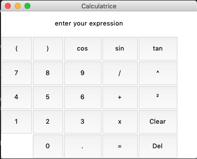

Voici le code, qui se trouve dans un seul fichier TP2.py:

```python
from tkinter import *
from math import *


expression = "" 

def press(num):
    """ Fonction de gestion de la pression d'un bouton de valeur "num"

    Cette fonction permet de gérer l'appui d'un touche (sauf "=", Clear 
    et Del).
    Elle met à jour le contenu de l'afficheur.
    Args:
        num (str) la touche pressée
    """
    global expression 
    expression = expression + str(num) 
    equation.set(expression)
    print(expression)


def equalpress():
    """ Fonction de gestion du bouton "="

    Cette touche permet de gérer le comportement du bouton "=".
    Elle évalue le contenu de la saisie avec la fonction eval()
    puis affiche le résultat dans l'afficheur. Si une exception
    est levée (par exemple en cas de division par zéro), l'afficheur
    prend la valeur ERROR et le buffer est vidé.
    """
    try: 
        global expression 
        total = str(eval(expression)) 
        equation.set(total) 
        print(total)
        expression = total
    except: 
        equation.set("ERROR") 
        expression = "" 

def delpress():
    """ Fonction de gestion du bouton "Del"

    Cette fonction permet de gérer le comportement du bouton "Del".
    Il permet d'effacer le dernier caractère saisi par l'utilisateur.
    Elle met à jour l'afficheur en conséquence.
    """
    global expression
    expression = expression[:-1]
    equation.set(expression)

def clear(): 
    """ Fonction de gestion du bouton "Clear"

    Cette fonction permet de vider complètement le buffer.
    Elle met à jour l'afficheur en conséquence.
    """
    global expression 
    expression = "" 
    equation.set("") 


if __name__ == "__main__":  
    window = Tk() 
    window.title("Calculatrice") 
    window.geometry("400x300") 

    # Définition de la taille des colonnes et lignes pour l'affichage
    for row in range(1,7):
        window.rowconfigure(row, weight=1)
        window.columnconfigure(row, weight=1)

    # Variables d'affichage
    equation = StringVar()
    equation.set('enter your expression') 

    # Afficheur
    expression_field = Label(window, textvariable=equation)
    expression_field.grid(row = 1, column = 1, columnspan = 5)

    # Boutons numériques
    # Pour éviter d'avoir à créer une fonction pour chaque bouton, j'ai 
    # créé une fonction press(num) qui sera appelée via une fonction 
    # lambda: le paramètre command prend un objet fonction, on ne peut 
    # pas lui associer de paramètre, d'où l'emploi de la fonction lambda
    button1 = Button(window, text=' 1 ', command=lambda: press(1)) 
    button1.grid(row = 5, column = 1, sticky='nesw')

    button2 = Button(window, text=' 2 ', command=lambda: press(2)) 
    button2.grid(row = 5, column = 2, sticky='nesw')

    button3 = Button(window, text=' 3 ', command=lambda: press(3)) 
    button3.grid(row = 5, column = 3, sticky='nesw') 

    button4 = Button(window, text=' 4 ', command=lambda: press(4)) 
    button4.grid(row = 4, column = 1, sticky='nesw')

    button5 = Button(window, text=' 5 ', command=lambda: press(5)) 
    button5.grid(row = 4, column = 2, sticky='nesw')

    button6 = Button(window, text=' 6 ', command=lambda: press(6)) 
    button6.grid(row = 4, column = 3, sticky='nesw')

    button7 = Button(window, text=' 7 ', command=lambda: press(7)) 
    button7.grid(row = 3, column = 1, sticky='nesw')

    button8 = Button(window, text=' 8 ', command=lambda: press(8)) 
    button8.grid(row = 3, column = 2, sticky='nesw')

    button9 = Button(window, text=' 9 ', command=lambda: press(9)) 
    button9.grid(row = 3, column = 3, sticky='nesw')

    button0 = Button(window, text=' 0 ', command=lambda: press(0)) 
    button0.grid(row = 6, column = 2, sticky='nesw')

    # Opérateurs
    plus = Button(window, text=' + ', command=lambda: press("+")) 
    plus.grid(row = 4, column = 4, sticky='nesw')

    minus = Button(window, text=' - ', command=lambda: press("-")) 

    multiply = Button(window, text=' x ', command=lambda: press("*"))
    multiply.grid(row = 5, column = 4, sticky='nesw')

    divide = Button(window, text=' / ', command=lambda: press("/"))
    divide.grid(row = 3, column = 4, sticky='nesw')

    equal = Button(window, text=' = ', command=equalpress)
    equal.grid(row = 6, column = 4, sticky='nesw')

    power2 = Button(window, text='²', command=lambda:press("**2"))
    power2.grid(row = 4, column = 5, sticky='nesw')

    powerX = Button(window, text='^', command=lambda:press("**"))
    powerX.grid(row = 3, column = 5, sticky='nesw')

    # Parenthèses
    open_parenthesis = Button(window, 
                              text=' ( ', command=lambda: press("("))
    open_parenthesis.grid(row = 2, column = 1, sticky='nesw')

    close_parenthesis = Button(window, text=' ) ', 
                               command=lambda: press(")"))
    close_parenthesis.grid(row = 2, column = 2, sticky='nesw')

    # Trigo
    cosine = Button(window, text=' cos ', command=lambda: press("cos"))
    cosine.grid(row = 2, column = 3, sticky='nesw')

    sinus = Button(window, text=' sin ', command=lambda: press("sin"))
    sinus.grid(row = 2, column = 4, sticky='nesw')

    tang = Button(window, text=' tan ', command=lambda: press("tan"))
    tang.grid(row = 2, column = 5, sticky='nesw')

    # Décimales
    coma = Button(window, text=' . ', command=lambda:press("."))
    coma.grid(row=6, column=3, sticky='nesw')

    # Gestion buffer
    clearall = Button(window, text='Clear', command=clear)
    clearall.grid(row = 5, column = 5, sticky='nesw')

    delete = Button(window, text='Del', command=delpress)
    delete.grid(row = 6, column = 5, sticky='nesw')

    # boucle principale
    window.mainloop() 
```

# **3. TP3 : Exceptions et chiffrement**

Le but de ce TP est de se familiariser avec la gestion des exceptions en Python ainsi que le chiffrement. Pour cela, j'ai adapté le code de l'éditeur de fichier vu dans le TP1 afin qu'il gère la connexion d'utilisateurs par mot de passes chiffrés à l'aide de la librairie bcrypt. Ensuite, j'ai modifié toutes les fonctions et autres lignes afin qu'elles puissent, dans le cas où celà était nécessaire, lever des exceptions, ou les gérer.

Le fichier des utilisateurs est un simple fichier texte nommé "users" et se trouve dans le dossier TP3.

Le code se trouve dans un seul et même fichier, dans le dossier TP3 :

```python
import os
import getpass
from bcrypt import hashpw, gensalt, checkpw

menu_dict = {"1": "Choisir un nom de fichier à ouvrir",
             "2": "Ajouter un texte",
             "3": "Afficher le fichier",
             "4": "Vider le fichier",
             "5": "Créer un utilisateur",
             "9": "Quitter"}

def exercice1():
    """ Fonction principale de l'exercice 1 : éditeur de fichiers
    
    Le but de cet exercice est de proposer un outil de gestion de fichier 
    sécurisé qui reprend les fonctionnalités développées au TP1, en y 
    ajoutant une authentification et la gestion d'exceptions.
    """
    # Variables
    name_of_file = None
    run_flag = True

    # Login
    print("===== CONNEXION =====")
    if login() is False:
        print("Utilisateur ou mot de passe incorrect")
        login()

    # Text editor
    print("===== EDITEUR DE TEXTE =====")
    while run_flag is True:
        
        # Show the menu
        print_dict(menu_dict)
        choix = input_menu()

        # Loading of the file
        if choix == "1":
            name_of_file_to_chek = input("> Entrez un nom de fichier : ")
            try:
                ctrl_filename(name_of_file_to_chek)
            except AssertionError:
                print('''!!! Le nom du fichier n'est pas une chaîne de 
                        caractère''')
            except ValueError:
                print("!!! Le nom du fichier est vide")
            else:
                name_of_file = name_of_file_to_chek
        # Appending some text
        elif choix == "2":
            text = input(">> Entrez le texte à ajouter au fichier : ")
            try:
                append_text(name_of_file, text)
            except AssertionError:
                print('''!! Un des paramètres saisis n'est pas une chaine 
                        de caractère''')
            else:
                print(">> Ligne ajoutée")
            
        # Reading the file
        elif choix == "3":
            if name_of_file is not None:
                with open(name_of_file, "r") as file_to_read:
                    file_content = file_to_read.readlines()
                    for num_line in range(len(file_content)):
                        print(file_content[num_line])
                file_to_read.close()
            else:
                print("!!! Veuillez ouvrir un fichier")
        # Overwriting the file
        elif choix == "4":
            if name_of_file is not None:
                file_to_overwrite = open(name_of_file, "w")
                file_to_overwrite.close()
            else:
                print("!!! Veuillez ouvrir un fichier")
        elif choix == "5":
            create_user()
        # Quit
        elif choix == "9":
            run_flag = False


def print_dict(dict):
    """
    Cette fonction imprime un dictionnaire dans la console

    Param:
        dict (Dictionary): the dictionary to print
    
    Example:
        >>> print_dict({"1": "Hello,", "2": "world!"})
        1 : Hello,
        2 : world!
    """
    for k in dict.keys():
        print(k + " : " + dict[k])


def input_menu():
    """ 
    Cette fonction imprime "Entrez un choix" dans la console et retourne 
    la chaine saisie par l'utilisateur. Elle vérifie que l'entrée est 
    conforme au dictionnaire défini gloabelement en début de fichier.

    Return:
        string: the string input by the user
    """
    choix = input(">>> Entrez un choix : ")
    while choix not in menu_dict.keys():
        choix = input(">>> Entrez un choix valide : ")
    return choix


def load_file(file_name):
    """ 
    Cette fonction charge un fichier en mode écriture et place le curseur
    à la fin. Si le fichier n'existe pas, il est créé.

    Args:
        file_name (str): the name of the file to open or create

    Returns:
        file: the file opened
    """
    file_loaded = open(file_name, "a")
    return file_loaded

def ctrl_filename(file_name):
    assert type(file_name) == str
    if not file_name.strip():
        raise ValueError

def append_text(name_of_file, text):
    assert type(name_of_file) == str
    assert type(text) == str 
    try:
        with open(name_of_file, "a") as file_to_edit:
            file_to_edit.write(text + '\n')
        file_to_edit.close()
    except FileExistsError:
        print("!! Le fichier est déjà ouvert en mode création exclusive")

def login():
    """ Fonction de connexion

    Demande à l'utilisateur un nom et un mot de passe et vérifie que le 
    couple est bien présent dans le fichier "users".

    Returns:
        True si le couple est bien présent dans le fichier "users", False 
        sinon

    """
    is_auth = False
    user = input("User: ")
    pswd = getpass.getpass()
    try:
        with open("users", "r") as usersfile:
            file_content = usersfile.readlines()
            for num_line in range(len(file_content)):
                if file_content[num_line] == (user+pswd):
                    is_auth = True
            usersfile.close()
    except: 
        print("!!! Impossible d'ouvrir le fichier des utilisateurs")
    finally:
        return is_auth

def create_user():
    """ Fonction de création d'un utilisateur 

    Demande à un utilisateur d'entrer un nom et un mot de passe du nouvel 
    utilisateur à créer puis l'ajoute au fichier "users" en le hashant. 
    Si le fichier n'existe pas, il est créé.
    """
    user = input("User: ")
    pswd = getpass.getpass()
    try:
        with open("users", "a") as usersfile:
            usersfile.write(user+hash_password(pswd))
    except: 
        print("!!! Impossible d'ouvrir le fichier des utilisateurs")
    else:
        print(">>> L'utilisateur "+user+ " a été créé.")

def hash_password(password_to_hash):
    """
    Hashage du password
    """
    return hashpw(password_to_hash, gensalt())


# Launch editor_main() as soon as this file is called
if __name__ == "__main__":
    exercice1()

```

# **4. TP4 : Matplotlib**

Le but de ce TP est de prendre en main l'outil Matplotlib qui permet de dessiner des graphiques dans une fenêtre, en reprenant une syntaxe similaire à celle de Matlab/Scilab. Le TP est composé de 6 questions qui sont présentées dans les sous-parties suivantes.

## **4.1. TP4 : Question 1**

Le but de cette question est de générer un ensemble de nombres aléatoires.
Pour cela, on fixe un nombre maximum de valeurs à générer max=500 ainsi qu'une seed. 
Ensuite, on génère des nombres suivants une loi uniforme grâce à la fonctiongenere_flt_uniform() définie dans ce module, puis des nombres suivants une loi normale grâce à la fonction genere_flt_normal() définie dans ce module. Ces fonctions utilisent la librairie random de Python. L'utilisation de la fonction numpy.linspace remplace en une seule ligne la génération de ces données.

```python
def genere_flt_normal(moy, stdev):
    """
    Retourne un float entre min et max selon une loi normale.
    Args:
        moy (float): la moyenne de la répartition
        stdev (float): l'écart-type de la répartition
    Return:
        (float) une valeur aléatoire selon une loi normale de paramètres 
                (moy, stdev)
    """
    return normalvariate(moy, stdev)

def genere_flt_uniform(min, max):
    """
    Retourne un float entre min et max selon une loi uniforme.
    Args:
        min (float): la borne inférieure
        max (float): la borne supérieure
    Return:
        (float) une valeur aléatoire entre min et max
    """
    return uniform(min, max)

def question1():
    """
    Le but de cette question est de générer un ensemble de nombres 
    aléatoires.
    Pour cela, on fixe un nombre maximum de valeurs à générer max=500 
    ainsi qu'une seed. 
    Ensuite, on génère des nombres suivants une loi uniforme grâce à la 
    fonction genere_flt_uniform() définie dans ce module, puis des 
    nombres suivants une loi normale grâce à la fonction 
    genere_flt_normal() définie dans ce module. Ces fonctions utilisent 
    la librairie random de Python. L'utilisation de la fonction 
    numpy.linspace remplace en une seule ligne la génération de ces 
    données.
    """
    max = 500
    seed = 100
    # Génération de nombres aléatoires
    serie_unif_X = []
    serie_unif_Y = []
    serie_norm_X = []
    serie_norm_Y = []
    for i in range(0, 2*max):
        serie_unif_X.append(i-max)
        serie_unif_Y.append(genere_flt_uniform(-max, max))
        serie_norm_X.append(i-max)
        serie_norm_Y.append(genere_flt_normal(0, 50))
    return serie_unif_X, serie_unif_Y, serie_norm_X, serie_norm_Y
```

## **4.2. TP4 : Question 2**

Le but de cette question est de générer un graphique à partir des données générées dans la question 1. Pour cela, on utilise les fonctions plot et show de la librairie matplotlib.
Pour la fonction plot, le premier argument est la liste des valeurs d'abscisse tandisque le second est la liste des valeurs en ordonnée.La fonction show() ne prend pas de paramètre.

L'exécution du code de cette question donne la fenêtre suivante :
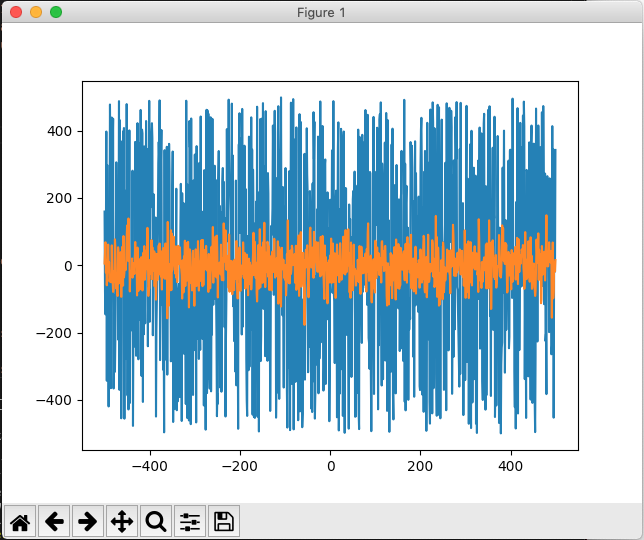

Le code est le suivant:

```python
def question2(unif_x, unif_y, norm_x, norm_y, should_plot=True):
    # Génère les graphiques
    if should_plot is True:
        plt.plot(unif_x, unif_y)
        plt.plot(norm_x, norm_y)
        plt.show()
```

## **4.3. TP4 : Question 3 & 4**

Le but de cette question est d'afficher plusieurs courbes avec styles et couleurs variés ainsi que modifier les noms des axes, la légende, ajouter des flèches pour montrer des zones.

Pour ce faire, j'ai décidé de réutiliser les 4 séries de données créés dans les questions précédentes et de diviser l'affichage de la fenêtre avec 4 "sous-graphiques", grâce à la fonction subplots(nb_lignes, nb_colonnes, partage_des_valeurs). Cette fonction retourne un objet figure ainsi que 4 objets représentants les graphiques individuels. Le paramètre de partage des valeurs en ordonnée (sharey) permet aux graphiques de fixer les mêmes bornes pour les axes y (au lieu des bornes automatiques), afin de pouvoir comparer plus facilement les répartitions. A gauche, les graphiques portent sur les données réparties uniformément, tandis que ceux de droite portent sur les données réparties normalement. Pour ces répartitions, on retrouve un nuage de point créé avec la fonction scatter(X, Y, couleur_marqueur, forme_marqueur) ainsiqu'un histogramme (hist(Y, couleur)) montrant clairement le type de répartition. J'ai ajouté des étiquettes fléchées avec la fonction annotate(titre, position, vecteur_fleche, style_fleche), un titre par colonnes (set_title()), et enfin un titre principal (suptitle()).

L'exécution du code de cette question donne l'écran suivant:
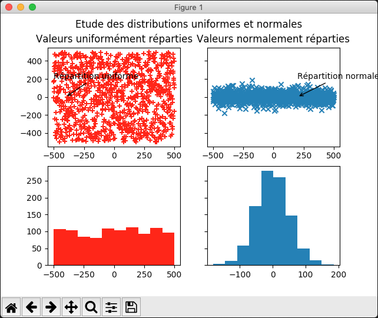

```python
def question34(serie_unif_X, serie_unif_Y, serie_norm_X, serie_norm_Y, 
                                                    should_plot=True):
    if should_plot is True:
        # Subplots: création de l'affichage divisé en 4
        fig, ((ax1, ax2), (ax3, ax4)) = plt.subplots(2,2, sharey='row')
        # Colonne répartition uniforme
        ax1.scatter(serie_unif_X, serie_unif_Y, c='red', marker='+')
        ax1.annotate("Répartition uniforme", 
                    xy=(-400, 0), 
                    xytext=(-500, 200),
                    arrowprops=dict(arrowstyle="->"))
        ax1.set_title("Valeurs uniformément réparties")
        ax3.hist(serie_unif_Y, color='red')
        # Colonne répartition normale
        ax2.scatter(serie_norm_X, serie_norm_Y, marker='x')
        ax2.annotate("Répartition normale", 
                    xy=(200, 0), 
                    xytext=(200, 200),
                    arrowprops=dict(arrowstyle="->"))
        ax2.set_title("Valeurs normalement réparties")
        ax4.hist(serie_norm_Y)
        # Titre + affichage
        fig.suptitle("Etude des distributions uniformes et normales")
        plt.show()
```

## **4.4. TP4 : question 5**

Le but de cette question est d'afficher un camembert (l'histogramme a déjà été traité dans la question précédente).

On crée une liste de 4 parts aléatoires selon une loi uniforme entre 0 et 25% ainsi qu'une liste de noms des parts qui seront affichés sur le camembert. Ensuite, on utilise la fonction pie(parts, noms).

L'exécution du code de cette question donne l'écran suivant:
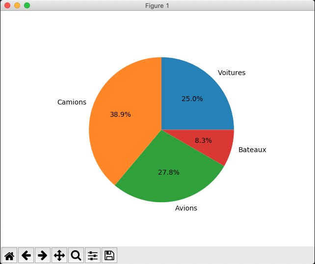

```python
def question5(should_plot=True):
    # Camembert
    if should_plot is True:
        p = [randint(0,25), randint(0,25), randint(0,25), randint(0,25)]
        labels = ["Voitures", "Camions", "Avions", "Bateaux"]
        plt.pie(p, labels=labels, autopct='%1.1f%%')
        plt.show()
```

## **4.5. TP4 : question 6**

Le but de cette question est d'afficher une surface 2D dans un espace 3D (mesh). Pour cela, on génère des valeurs entre -5 et 5 pour deux vecteurs : X et Y en utilisant la fonction linspace issue de numpy. Ensuite on créé deux matrices de coordonnées à partir des vecteurs X et Y en utilisant la fonction numpy.meshgrid. Enfin on créé la matrice des valeurs que l'on veut tracer : ici on a choisi de tracer la fonction $\sqrt{X^2+Y^2}$. Enfin, on trace la forme dans un graphique 3D en utilisant les valeurs généres précédemment.

L'exécution du code lié à cette question donne la fenêtre suivante:
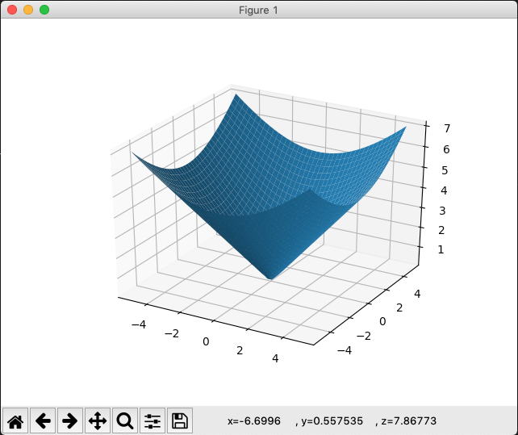

```python
def question6():
    X = np.linspace(-5,5,40)
    Y = np.linspace(-5,5,40)
    X,Y = np.meshgrid(X,Y)
    Z = np.sqrt(X**2+Y**2)
    plt.gca(projection='3d').plot_surface(X,Y,Z.T)
    plt.show()
```

# **5. TP5 : SQLite**

Le but de ce TP est de mettre en place une base de données avec SQLite. L'exécutable `sqlite3` est déjà présent dans le dossier de ce TP, il est inutile de le réinstaller. En outre, j'ai décidé de ne pas utiliser la librairie ORM SQLAlchemy, car c'est une librairie que je connais déjà. Je perds du temps, mais cela m'a permis de manipuler plus en profondeur le langage.

## **5.1. TP5: connexion à la base de données**

Dans le script principal `TP5.py`, avant de commencer les exercices, il est necéssaire de créer la connexion à la base SQLite. Pour cela, il faut ajouter la ligne `conn = sqlite3.connect("France.db")`. La base de données "France" sera accédée par cet objet `conn` tout au long du TP.

## **5.2. TP5: récupération des urls des fichiers CSV**

Les fichiers CSV de cet exercice sont placés dans un dossier `/Data`. Comme je travaille sous plusieurs systèmes d'exploitation, je ne peux pas spécifier leur chemin "en dur". Pour y remédier, j'utilise les librairies `os` et `sys` qui possèdent des attributs et méthodes très utiles dans mon cas. 

Ainsi, la commande `os.path.abspath(__file__)` renvoie le chemin absolu du fichier `__file__`, c'est-à-dire du fichier TP5.py. Ensuite, la commande `os.path.dirname(chemin/absolu/d'un/fichier)` renvoie le chemin absolu du dossier parent du fichier spécifié. Avec, la commande précédente, on peut donc retrouver le dossier "TP5/" parent du fichier TP5.py. Ensuite, pour accéder au dossier "/Data", j'ai utilisé la commande `os.path.join(arg1, arg2)` qui permet de lier un chemin avec un autre. En somme, dans le TP j'utiliserai les variables constantes suivantes :

```python
import os
import sys


dossier_parent = os.path.dirname(os.path.abspath(__file__))
FICHIER_COMMUNES = os.path.join(dossier_parent, "Data") + \
                    "/test_commune.csv"
FICHIER_DEPARTEMENTS = os.path.join(dossier_parent, "Data") + \
                    "/test_dept.csv"
FICHIER_REGIONS = os.path.join(dossier_parent, "Data") + \
                    "/test_region.csv"
```

## **5.3 TP5.py: code complet**

Le but de cette question est de charger les données des communes, départements et régions issues des fichiers CSV fourni dans le dossier `Data/` de ce TP.

Le code complet est le suivant : 

```python
import sqlite3
import csv
import os
import sys
from Commune import Commune, CommuneDAO
from Departement import Departement, DepartementDAO
from Region import Region, RegionDAO


dossier_parent = os.path.dirname(os.path.abspath(__file__))
FICHIER_COMMUNES = os.path.join(dossier_parent, "Data") + \
                    "/test_commune.csv"
FICHIER_DEPARTEMENTS = os.path.join(dossier_parent, "Data") + \
                    "/test_dept.csv"
FICHIER_REGIONS = os.path.join(dossier_parent, "Data") + \
                    "/test_region.csv"

def parse_csv(csv_name):
    """ EXERCICE 1 : lecture des fichiers csv

    Cette fonction permet de lire les fichiers communes, départements et 
    régions.csv. Les fichiers CSV comportent des entêtes sur 8 lignes. 
    Le parser s'en débarasse donc.

    Args:
        csv_name le nom du fichier csv à parser

    Return:
        un tableau à deux dimensions contenant pour chaque ligne une 
        liste de champs
    """
    rows = []
    index = 0
    with open(csv_name, "r") as csv_file:
        csv_reader = csv.reader(csv_file, delimiter=";")
        for row in csv_reader:
            index = index + 1
            # Ne pas prendre en compte les 8 premières lignes
            if index < 9:
                continue
            rows.append(row)
            #print(row)
    return rows

def peuple_table_commune(db_conn, dao, info_communes):
    """ EXERCICE 1 : Fonction de peuplement de la table Commune de la 
    base de données

    Cette fonction permet, à partir d'un tableau à deux dimensions, de 
    peupler la table Commune de la base de données. Le paramètre 
    info_communes est une liste de listes contenant les informations des 
    communes recueillies grâce à la fonction parse_csv().

    Args:
        info_communes ([[string]]) informations des communes
    """
    res = False
    for c in info_communes:
        commune = Commune(c[5], c[6], c[9], c[2])
        status = dao.insert(db_conn, commune)
        if status == False:
            print("Impossible d'insérer la commune " + c[5])
            res = False
            break
        else:
            print("Commune "+ c[5] + " insérée dans la base")
            res = True
    return res

def peuple_table_departement(db_conn, dao, info_depts):
    """ EXERCICE 1 : Fonction de peuplement de la table Departement de la 
    base de données

    Cette fonction permet, à partir d'un tableau à deux dimensions, de 
    peupler la table Departement de la base de données. Le paramètre 
    info_depts est une liste de listes contenant les informations des dé-
    partements recueillies grâce à la fonction parse_csv().

    Args:
        info_depts ([[string]]) informations des départements
    """
    res = False
    for d in info_depts:
        dept = Departement(d[2], d[3], d[0])
        status = dao.insert(db_conn, dept)
        if status == False:
            print("Impossible d'insérer le département " + d[2])
            res = False
            break
        else:
            print("Département "+ d[2] + " inséré dans la base")
            res = True
    return res

def peuple_table_region(db_conn, dao, info_regions):
    """ EXERCICE 1 : Fonction de peuplement de la table Region de la base 
    de données

    Cette fonction permet, à partir d'un tableau à deux dimensions, de 
    peupler la table Region de la base de données. Le paramètre 
    info_regions est une liste de listes contenant les informations des 
    régions recueillies grâce à la fonction parse_csv().

    Args:
        info_regions ([[string]]) informations des régions
    """
    res = False
    for r in info_regions:
        region = Region(r[0], r[1])
        status = dao.insert(db_conn, region)
        if status == False:
            print("Impossible d'insérer la région " + r[1])
            res = False
            break
        else:
            print("Région "+ r[1] + " insérée dans la base")
            res = True
    return res

if __name__=="__main__":

    status = False
    # Connexion
    conn = sqlite3.connect("France.db")

    print("###################### EXERCICE 1 #########################")
    # Chargement des données des communes, régions et départements dans 
    # une base de données nommée "France"
    ############################ COMMUNES ###############################
    commune_dao = CommuneDAO()
    # Lecture des communes
    info_communes = parse_csv(FICHIER_COMMUNES)
    # Création de la table communes
    status = commune_dao.create(conn)
    if status == False:
        print("Création table commune impossible")
    # Insertion des données des communes
    status = peuple_table_commune(conn, commune_dao, info_communes)
    if status == False:
        print("Insertion des communes impossible")

    # Validation
    if status == True:
        print("COMMIT")
        conn.commit()
        status = False
    else:
        print("ROLLBACK")
        conn.rollback()
        status = False

    ########################### DEPARTEMENTS ############################
    dept_dao = DepartementDAO()
    # Lecture des departements
    
    info_depts = parse_csv(FICHIER_DEPARTEMENTS)
    # Création de la table departements
    status = dept_dao.create(conn)
    if status == False:
        print("Création table département impossible")
    # Insertion des données des departements
    status = peuple_table_departement(conn, dept_dao, info_depts)
    if status == False:
        print("Insertion des départements impossible")

    # Validation
    if status == True:
        print("COMMIT")
        conn.commit()
        status = False
    else:
        print("ROLLBACK")
        conn.rollback()
        status = False


    ############################## REGIONS ##############################
    region_dao = RegionDAO()
    # Lecture des région
    info_regions = parse_csv(FICHIER_REGIONS)
    # Création de la table région
    status = region_dao.create(conn)
    if status == False:
        print("Création table région impossible")
    # Insertion des données des régions
    status = peuple_table_region(conn, region_dao, info_regions)
    if status == False:
        print("Insertion des régions impossible")
        
    # Validation
    if status == True:
        print("COMMIT")
        conn.commit()
        status = False
    else:
        print("ROLLBACK")
        conn.rollback()
        status = False

    print("######################## EXERCICE 2 ########################")
    # Le but est de calculer les populations des régions et des dépar-
    # tements à partir des populations entrées dans la base de données 
    # puis de les comparer aux données des fichiers csv

    ## Calculs et affichage des populations par région
    # Parcours de la liste des régions en base
    liste_region = region_dao.read_all(conn)
    for region in liste_region:
        print("> REGION #" + str(region[0]))
        pop_region = 0
        # Parcours de la liste des départements par région
        liste_dept_de_la_reg = dept_dao.read_by_region(conn, region[0])
        for dept in liste_dept_de_la_reg:
            print(">> DEPARTEMENT #" + str(dept[0]))
            pop_dept = 0
            # Parcours de la liste des communes par département
            liste_comm_du_dept = commune_dao.read_by_dept(conn, dept[0])
            for commune in liste_comm_du_dept:
                #print(commune)
                pop_dept += commune[2]
            pop_region += pop_dept
            print(">> Population du département = " + str(pop_dept))
        print("> Population de la région = " + str(pop_region))

    print("####################### EXERCICE 3 #########################")
    # Le but de cet exercice est d'afficher la liste des communes ayant 
    # le  même nom, ainsi que les numéros de commune
    liste_comm = commune_dao.read_all(conn)
    liste_communes_meme_nom = filter(lambda x,y: x[1]==y[1], liste_comm)
    print(type(liste_communes_meme_nom))
    # NON FONCTIONNEL

    print("######################## EXERCICE 4 ########################")
    # Le but de cet exercice est de décharger la base de données dans un 
    # flux XML mais aussi de le charger. Pour ce faire, j'utilise la lib-
    # rairie lxml.
    from TP5_XML import decharge_xml_communes
    from TP5_XML import decharge_xml_departements
    from TP5_XML import decharge_xml_regions
    from TP5_XML import charge_xml_commune
    from lxml import etree

    ## Déchargement XML
    # Communes
    liste_communes = commune_dao.read_all(conn)
    decharge_xml_communes(liste_communes)
    # Départements
    liste_departements = dept_dao.read_all(conn)
    decharge_xml_departements(liste_departements)
    # Régions
    liste_regions = region_dao.read_all(conn)
    decharge_xml_regions(liste_regions)

    # Chargement XML
    tree_communes = etree.parse("Communes.xml")
    charge_xml_commune(conn, commune_dao, tree_communes)

    # Fermeture
    conn.close()
```

## **5.4. TP5: Communes.py**

Ce fichier regroupe la définition de la classe `Commune` que j'ai utilisée dans le TP, mais aussi la classe `CommuneDAO` qui m'a permis de créer la table, et lire, insérer, supprimer ou mettre à jour un enregistrement. Le code de ce fichier est le suivant :

```python
import sqlite3

class Commune:
    """ 
    Cette classe représente une commune

    Attr:
        _code_commune (int): l'identifiant commune (PK)
        _nom_commune (str): le nom de la commune
        _pop_totale (int): le nombre d'habitants
        _code_dept (int): pseudo clé étrangère sur les département
    """
    def __init__(self, code_commune, nom_commune, pop_totale, code_dept):
        self._code_commune = code_commune
        self._nom_commune = nom_commune
        self._pop_totale = pop_totale
        self._code_dept = code_dept

    def __str__(self):
        s = "#" + self._code_commune + " " + \ 
                self._nom_commune + " : " + self._pop_totale
        return s

class CommuneDAO:
    """
    Cette classe permet de créer la table "commune" dans la base de 
    données mais aussi d'insérer un élément, supprimer un élément, lire 
    un élément, lire un élément selon son département, lire tous les 
    éléments de la table et enfin mettre à jour un élément.
    """
    def create(self, db_conn):
        """ Fonction de création de la table "commune" dans la base spéci
        fiée par l'argument db_conn

        Args:
            db_conn (Connection) objet de connexion à la base de données

        Return:
            True si la création s'est effectuée correctement, False sinon
        """
        sql = '''CREATE TABLE commune (
                    id_commune     INT CONSTRAINT pk_commune PRIMARY KEY,
                    nom_commune    CHARACTER(100),
                    pop_totale     INT,
                    code_dept      INT
                    );'''
        try:
            db_conn.execute(sql)
        except sqlite3.OperationalError:
            print("CommuneDAO.create: sqlite3.OperationalError")
            return False
        else:
            return True
    
    def insert(self, db_conn, commune):
        """ Fonction d'insertion d'un objet Commune dans la base de 
        données

        Args:
            db_conn (Connection) objet de connexion à la base de données
            commune (Commune) objet à insérer dans la base de données
        Return:
            True si l'insertion s'est correctement déroulée, False sinon
        """
        if isinstance(commune, Commune) == False:
            raise TypeError
        sql = "INSERT INTO commune VALUES (?, ?, ?, ?);"
        values = (commune._code_commune, commune._nom_commune, commune._pop_totale, commune._code_dept)
        try:
            db_conn.execute(sql, values)
        except sqlite3.OperationalError:
            print("CommuneDAO.insert: sqlite3.OperationalError")
            return False
        except sqlite3.IntegrityError:
            print("CommuneDAO.insert: violation de contrainte d'unicité")
            return False
        else:
             return True

    def delete(self, db_conn, code_commune):
        """ Fonction de suppression d'un élément dans la base de données

        Args:
            db_conn (Connection) objet de connexion à la base de données
            code_commune (int) identifiant de l'objet à supprimer
        Return:
            True si la suppression s'est correctement déroulée, 
            False sinon
        """
        sql = ''' DELETE FROM commune
                  WHERE id_commune = ?'''
        try:
            db_conn.execute(sql, (code_commune,))
        except sqlite3.OperationalError:
            print("CommuneDAO.delete: sqlite3.OperationalError")
            return False
        else:
            return True

    def read(self, db_conn, code_commune):
        """ Fonction de lecture d'un élément dans la base de données

        Cette fonction permet de lire un élément "Commune" dans la base 
        de données en fonction de son code_commune, identifiant primaire 
        de la table. Il est important de noter que cette fonction fait 
        appel à la méthode cursor.fetchall()qui renvoie une liste 
        d'éléments répondant à la clause WHERE spécifiée dans la requête.
        L'utilisation de cursor.fetchone() n'a pas été jugée prudente.
        Ici, puisque code_commune est l'identifiant unique de la table, 
        la liste retrounée contiendra toujours au plus 1 élément.

        Args:
            db_conn (Connection) objet de connexion à la base de données
            code_commune (int) identifiant de l'objet à lire
        Return:
            (list) liste d'éléments vérifiants le code_commune, None 
            sinon
        """
        sql = ''' SELECT * 
                  FROM commune
                  WHERE id_commune = ?'''
        curs = db_conn.cursor()
        try:
            curs.execute(sql, (code_commune,))
            res = curs.fetchall()
        except sqlite3.OperationalError:
            print("CommuneDAO.read: sqlite3.OperationalError")
            return 
        else:
            return res

    def read_by_dept(self, db_conn, code_dept):
        """ Fonction de lecture d'un élément dans la base de données

        Cette fonction permet de lire un élément "Commune" dans la base 
        de données en fonction de son code_dept. 

        Args:
            db_conn (Connection) objet de connexion à la base de données
            code_dept (int) identifiant du département de l'objet à lire
        Return:
            (list) liste d'éléments vérifiants le code_dept, None sinon
        """
        sql = ''' SELECT * 
                  FROM commune
                  WHERE code_dept = ?'''
        curs = db_conn.cursor()
        try:
            curs.execute(sql, (code_dept,))
            res = curs.fetchall()
        except sqlite3.OperationalError:
            print("CommuneDAO.read_by_dept: sqlite3.OperationalError")
            return
        else:
            return res
    
    def read_all(self, db_conn):
        """ Fonction de lecture de tous les éléments dans la base de 
        données

        Cette fonction permet de lire tous les éléments "Commune" dans la 
        base de données.

        Args:
            db_conn (Connection) objet de connexion à la base de données
        Return:
            (list) liste d'éléments, None si aucun élément n'est présent 
            dans la base.
        """
        sql = ''' SELECT * 
                  FROM commune '''
        curs = db_conn.cursor()
        try:
            curs.execute(sql)
            res = curs.fetchall()
        except sqlite3.OperationalError:
            print("CommuneDAO.read_all: sqlite3.OperationalError")
            return 
        else:
            return res

    def update(self, db_conn, code_commune, nom_commune, pop_totale, 
                                                            code_dept):
        """ Fonction de mise à jour d'un élément dans la base de données

        Args:
            db_conn (Connection) objet de connexion à la base de données
            code_commune (int) identifiant de l'objet à màj
            nom_commune (str) nom de l'objet à màj
            pop_totale (int) pop.totale de l'objet à màj
            code_dept (int) code département de l'objet à màj
        """
        sql = ''' UPDATE commune
                    SET nom_commune = ?,
                        pop_totale = ?,
                        code_dept = ?
                    WHERE id_commune = ?;'''
        values = (nom_commune, pop_totale, code_dept, code_commune)
        try:
            db_conn.execute(sql, values)
        except sqlite3.OperationalError:
            print("CommuneDAO.update: sqlite3.OperationalError")
            return False
        else:
            return True
```

## **5.5. TP5: Departement.py**

Comme pour le fichier Commune.py, celui-ci regroupe la classe Departement et DepartementDAO.

Voici le code complet de la librairie:

```python
import sqlite3

class Departement:
    """ 
    Cette classe représente un département

    Attr:
        _code_dept (int): code du département, sert de PK
        _nom_dept (string): nom du département
        _code_region (int): code de la région à laquelle appartient le 
                            départment
    """
    def __init__(self, code_dept, nom_dept, code_region):
        self._code_dept = code_dept
        self._nom_dept = nom_dept
        self._code_region = code_region

    def __str__(self):
        c = "#" + self._code_dept + " " + self._nom_dept + \
        ", région: " + self._code_region
        return c

class DepartementDAO:
    def create(self, db_conn):
        sql = '''CREATE TABLE departement (
                    id_dept      INT CONSTRAINT pk_dept PRIMARY KEY,
                    nom_dept     CHARACTER(30),
                    code_region  INT
                    );'''
        try:
            db_conn.execute(sql)
        except sqlite3.OperationalError:
            print("DepartementDAO.create: sqlite3.OperationalError")
            return False
        else:
            return True
    
    def insert(self, db_conn, dept):
        if isinstance(dept, Departement) == False:
            raise TypeError
        sql = ''' INSERT INTO departement VALUES(?, ?, ?);'''
        values = (dept._code_dept, dept._nom_dept, dept._code_region)
        try:
            db_conn.execute(sql, values)
        except sqlite3.OperationalError:
            print("DepartementDAO.insert: sqlite3.OperationalError")
            return False
        except sqlite3.IntegrityError:
            print("DepartementDAO.insert: viol contrainte d'unicité")
            return False
        else:
            return True

    def delete(self, db_conn, code_dept):
        sql = ''' DELETE FROM departement
                  WHERE id_dept = ?'''
        try:
            db_conn.execute(sql, (code_dept,))
        except sqlite3.OperationalError:
            print("DepartementDAO.delete: sqlite3.OperationalError")
            return   

    def read(self, db_conn, code_dept):
        sql = ''' SELECT * 
                  FROM departement
                  WHERE id_dept = ? '''
        curs = db_conn.cursor()
        try:
            curs.execute(sql, (code_dept,))
            res = curs.fetchall()
        except sqlite3.OperationalError:
            print("DepartementDAO.read: sqlite3.OperationalError")
            return 
        else:
            return Departement(res[0][0], res[0][1], res[0][2])
    
    def read_by_region(self, db_conn, code_region):
        sql = ''' SELECT * 
                  FROM departement
                  WHERE code_region = ?'''
        curs = db_conn.cursor()
        try:
            curs.execute(sql, (code_region,))
            res = curs.fetchall()
        except sqlite3.OperationalError:
            print("DepartementDAO.read_by_region sql3.OperationalError")
            return
        else:
            return res

    def read_all(self, db_conn):
        sql = ''' SELECT * 
                  FROM departement '''
        curs = db_conn.cursor()
        try:
            curs.execute(sql)
            res = curs.fetchall()
        except sqlite3.OperationalError:
            print("DepartementDAO.read_all: sqlite3.OperationalError")
            return 
        else:
            return res

    def update(self, db_conn, code_dept, nom_dept, code_region):
        sql = ''' UPDATE departement
                    SET nom_dept = ?,
                        code_region = ?
                    WHERE id_dept = ?;'''
        values = (nom_dept, code_region, code_dept)
        try:
            db_conn.execute(sql, values)
        except sqlite3.OperationalError:
            print("DepartementDAO.update: sqlite3.OperationalError")
            return False
        else:
            return True
```

## **5.6. Region.py**

De même, le fichier Region.py regroupe les classes Region et RegionDAO.

Le code est le suivant:

```python
import sqlite3

class Region:
    """ 
    Cette classe représente un région

    Attr:
        _code_region (int): code de la région, sert de PK
        _nom_region (string): nom de la région
    """
    def __init__(self, code_region, nom_region):
        self._code_region = code_region
        self._nom_region = nom_region

    def __str__(self):
        return "#" + self._code_region + " " + self._nom_region

class RegionDAO:
    def create(self, db_conn):
        sql = '''CREATE TABLE region (
                    id_region     INT CONSTRAINT pk_region PRIMARY KEY,
                    nom_region    CHARACTER(30)
                    );'''
        try:
            db_conn.execute(sql)
        except sqlite3.OperationalError:
            print("RegionDAO.create: sqlite3.OperationalError")
            return False
        else:
            print("Table Region créée")
            return True
    
    def insert(self, db_conn, region):
        if isinstance(region, Region) == False:
            raise TypeError
        sql = "INSERT INTO region VALUES (?, ?);"
        values = (region._code_region, region._nom_region)
        try:
            db_conn.execute(sql, values)
        except sqlite3.OperationalError:
            print("RegionDAO.insert: sqlite3.OperationalError")
            return False
        except sqlite3.IntegrityError:
            print("RegionDAO.insert: violation de contrainte d'unicité")
            return False
        else:
             return True

    def delete(self, db_conn, code_region):
        sql = ''' DELETE FROM region
                  WHERE id_region = ?'''
        try:
            db_conn.execute(sql, (code_region,))
        except sqlite3.OperationalError:
            print("RegionDAO.delete: sqlite3.OperationalError")
            return   

    def read(self, db_conn, code_region):
        sql = ''' SELECT * 
                  FROM region
                  WHERE id_region = ? '''
        try:
            res = db_conn.execute(sql, (code_region,))
        except sqlite3.OperationalError:
            print("RegionDAO.read: sqlite3.OperationalError")
            return 
        else:
            return res
    
    def read_all(self, db_conn):
        sql = ''' SELECT * 
                  FROM region '''
        curs = db_conn.cursor()
        try:
            curs.execute(sql)
            res = curs.fetchall()
        except sqlite3.OperationalError:
            print("RegionDAO.read_all: sqlite3.OperationalError")
            return 
        else:
            return res

    def update(self, db_conn, code_region, nom_region):
        sql = ''' UPDATE region
                    SET nom_region = ?,
                    WHERE id_region = ?;'''
        values = (nom_region, (code_region,))
        try:
            db_conn.execute(sql, values)
        except sqlite3.OperationalError:
            print("RegionDAO.update: sqlite3.OperationalError")
            return False
        else:
            return True

```

## **5.7. TP5_XML.py**

Ce fichier est lié à la question 4. Il contient les fonctions permettant de décharger
les éléments dans la base de données. Il contient aussi un essaie d'une fonction de chargement
à partir d'un flux XML, mais qui n'est pas fonctionnelle...

Cette librairie utilise la librairie `lxml`.

Le code est le suivant :

```python
from lxml import etree
from Commune import Commune, CommuneDAO

def decharge_xml_communes(liste_communes):
    """ EXERICE 4: déchargement de la table Commune

    Cette fonction permet de décharger une liste de communes dans un fic-
    hier XML nommé "Communes.xml"

    Args:
        communes ([[str]]): liste des communes
    """
    # Création du noeud parent "communes"
    communes = etree.Element("communes")
    for commune_element in liste_communes:
        # Sous neoud commune
        commune = etree.SubElement(communes, "commune")
        # Attribut data_id
        commune.set("data_id", str(commune_element[0]))
        # Sous noeud nom
        nom = etree.SubElement(commune, "nom")
        nom.text = commune_element[1]
        # Sous noeud nom
        population = etree.SubElement(commune, "population")
        population.text = str(commune_element[2])
        # Sous noeud nom
        departement = etree.SubElement(commune, "departement")
        departement.text = str(commune_element[3])
    # Ecriture dans fichier Communes.xml
    communes_xml = open("Communes.xml", "wb")
    communes_xml.write(b'<?xml version="1.0" encoding="UTF-8"?>\n')
    communes_xml.write(etree.tostring(communes, pretty_print=True))
    communes_xml.close()

def decharge_xml_departements(liste_departements):
    """ EXERICE 4: déchargement de la table Departement

    Cette fonction permet de décharger une liste de départements dans un 
    fichier XML nommé "Departements.xml"

    Args:
        liste_departements ([[str]]): liste des communes
    """
    # Création du noeud parent "departements"
    departements = etree.Element("departements")
    for departement_element in liste_departements:
        # Sous neoud departement
        departement = etree.SubElement(departements, "departement")
        # Attribut data_id
        departement.set("data_id", str(departement_element[0]))
        # Sous noeud nom
        nom = etree.SubElement(departement, "nom")
        nom.text = departement_element[1]
        # Sous noeud region
        region = etree.SubElement(departement, "region")
        region.text = str(departement_element[2])
    # Ecriture dans fichier Departements.xml
    departements_xml = open("Departements.xml", "wb")
    departements_xml.write(b'<?xml version="1.0" encoding="UTF-8"?>\n')
    departements_xml.write(etree.tostring(departements, pretty_print=True))
    departements_xml.close()

def decharge_xml_regions(liste_regions):
    """ EXERICE 4: déchargement de la table Region

    Cette fonction permet de décharger une liste de region dans un 
    fichier XML nommé "Regions.xml"

    Args:
        liste_regions ([[str]]): liste des regions
    """
    # Création du noeud parent "regions"
    regions = etree.Element("regions")
    for region_element in liste_regions:
        # Sous neoud region
        region = etree.SubElement(regions, "region")
        # Attribut data_id
        region.set("data_id", str(region_element[0]))
        # Sous noeud nom
        nom = etree.SubElement(region, "nom")
        nom.text = region_element[1]
    # Ecriture dans fichier Communes.xml
    regions_xml = open("Regions.xml", "wb")
    regions_xml.write(b'<?xml version="1.0" encoding="UTF-8"?>\n')
    regions_xml.write(etree.tostring(regions, pretty_print=True))
    regions_xml.close()

def charge_xml_commune(db_conn, dao, etree_commmune):
    # Récupération des données et mise en forme
    communes_list = ()
    # Parcours des noeuds "Commune" du flux XML
    for node in etree_commmune.xpath("/communes/commune"):
        commune_el = ()
        # Récupération de l'attribut data_id et des sous-élements
        for child in node.getchildren():
            commune_el += tuple([node.get("data_id")] + [child.text])
            communes_list += commune_el

    # Insertion en base
    for c in communes_list:
        commune_obj = Commune(c[0], c[1], c[3], c[5])
        dao.insert(db_conn, commune_obj)
```

Les fonctions de déchargements donnent les trois fichiers XML suivants:

* Communes.xml

```xml
<?xml version="1.0" encoding="UTF-8"?>
<communes>
  <commune data_id="1">
    <nom>Commune 1</nom>
    <population>100</population>
    <departement>1</departement>
  </commune>
  <commune data_id="2">
    <nom>Commune 2</nom>
    <population>100</population>
    <departement>1</departement>
  </commune>
  <commune data_id="3">
    <nom>Commune 3</nom>
    <population>100</population>
    <departement>2</departement>
  </commune>
  <commune data_id="4">
    <nom>Commune 4</nom>
    <population>100</population>
    <departement>2</departement>
  </commune>
  <commune data_id="5">
    <nom>Commune 5</nom>
    <population>100</population>
    <departement>3</departement>
  </commune>
  <commune data_id="6">
    <nom>Commune 6</nom>
    <population>100</population>
    <departement>3</departement>
  </commune>
  <commune data_id="7">
    <nom>Commune 7</nom>
    <population>100</population>
    <departement>4</departement>
  </commune>
  <commune data_id="8">
    <nom>Commune 8</nom>
    <population>100</population>
    <departement>5</departement>
  </commune>
</communes>
```

* Departements.xml
  
```xml
<?xml version="1.0" encoding="UTF-8"?>
<departements>
  <departement data_id="1">
    <nom>Departement 1</nom>
    <region>1</region>
  </departement>
  <departement data_id="2">
    <nom>Departement 2</nom>
    <region>1</region>
  </departement>
  <departement data_id="3">
    <nom>Departement 3</nom>
    <region>1</region>
  </departement>
  <departement data_id="4">
    <nom>Departement 4</nom>
    <region>2</region>
  </departement>
  <departement data_id="5">
    <nom>Departement 5</nom>
    <region>2</region>
  </departement>
</departements>
```

* Regions.xml

```xml
<?xml version="1.0" encoding="UTF-8"?>
<regions>
  <region data_id="1">
    <nom>Region 1</nom>
  </region>
  <region data_id="2">
    <nom>Region 2</nom>
  </region>
</regions>
```

# **6. TP6 : Numpy/Scipy**

Le but de ce TP est de prendre en main les librairies Numpy et Scipy.

L'exécution du code de ce TP donne, dans la console ou en fenêtre, les résultats suivants:

* Question 1: tableau 3D

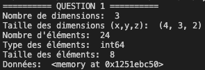

* Question 2: 2 matrices 3x3 et transposition

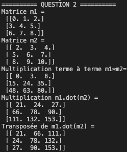

* Question 3: déterminant, inverse, résolution d'un système, vecteurs et valeurs propres

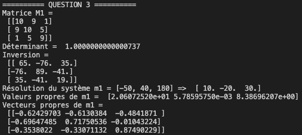

* Question 4: curve fitting

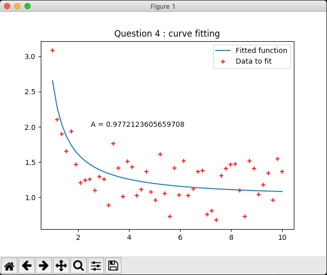

* Question 5: lecture d'image (non traitée)


Le code du TP est le suivant : 

```python
import numpy as np
from scipy.optimize import curve_fit
from scipy import ndimage
import matplotlib.pyplot as plt
from math import exp

def question1():
    """
    Le but de la question est de créer un tableau de dimension 3
    avec un shape de (4, 3, 2) remplit avec des nombres aléatoires.
    
    Pour y répondre, on génère d'abord un tableau de 24 nombres 
    aléatoires à l'aide de la fonction numpy.randint(). Ensuite, on les 
    ré-arrange dans un tableau à trois dimensions avec la fonction 
    numpy.reshape(4,3,2). Enfin, on affiche ses attributs ndim, shape, 
    size, dtype, itemsize, data.
    """
    # Génération des nombres aléatoires
    arr = np.random.randint(low=1, high=10, size=24)
    # Tableau 3D
    arr = arr.reshape(4,3,2)
    # Attributs
    print("Nombre de dimensions: ", arr.ndim)
    print("Taille des dimensions (x,y,z): ", arr.shape)
    print("Nombre d'éléments: ", arr.size)
    print("Type des éléments: ", arr.dtype)
    print("Taille des éléments: ", arr.itemsize)
    print("Données: ", arr.data)

    return arr

def question2():
    """
    Le but de la question est de créer 2 matrices 3x3 initialisées avec
    les entiers de 0 à 8 pour la 1e et de 2 à 10 pour la 2e puis calculer
    le produit des 2 (différence entre * et dot). Transposer une matrice.

    On génère les valeurs des deux matrices m1 et m2 à l'aide de la fonc-
    tion linspace() puis on forme les dimensions avec reshape(). On 
    calcule ensuite le produit terme à terme des deux matrices avec 
    l'opérateur '.'
    On transpose ensuite la matrice issue de m1.dot(m2)
    """
    m1 = np.linspace(start=0, stop=8, num=9)
    m1 = m1.reshape(3,3)
    print("Matrice m1 = \n", m1)
    m2 = np.linspace(start=2, stop=10, num=9)
    m2 = m2.reshape(3,3)
    print("Matrice m2 = \n", m2)
    # Multiplication
    terme_a_terme = m1*m2
    print("Multiplication terme à terme m1*m2= \n", terme_a_terme)
    mult = m1.dot(m2)
    print("Multiplication m1.dot(m2) = \n", mult)
    # Transposition
    transp = mult.transpose()
    print("Transposée de m1.dot(m2) = \n", transp)

def question3():
    """
    Cette question a pour but de calculer le déterminant et l’inverse 
    d’une matrice, résoudre un système d’équations linéaires, puis 
    calculer les valeurs et vecteurs propres d’une matrice.

    D'abord, on instancie une matrice m1 telle que : 
    m1 = [[10, 9, 1], [9, 10, 5], [1, 5, 9]]
    Ensuite, on calcule son déterminant à l'aide de la fonction 
    np.linalg.det puis son inverse à l'aide de la fonction np.linalg.inv.
    Ensuite, on résoud le système m1 = [-50, 40, 180] à l'aide de 
    np.linalg.solve.
    Enfin, on détermine les valeurs et vecteurs propres de m1 avec la 
    fonction np.linalg.eig(m1)
    """
    # Création matrice de travail
    m1 = np.array([[10, 9, 1], [9, 10, 5], [1, 5, 9]])
    print("Matrice M1 = \n", m1)
    # Calcul du déterminant
    det = np.linalg.det(m1)
    inv = np.linalg.inv(m1)
    print("Déterminant = ", det)
    print("Inversion = \n", inv)
    # Résolution du système
    m2 = np.array([-50, 40, 180])
    res = np.linalg.solve(m1,m2)
    print("Résolution du système m1 = [-50, 40, 180] => ", res)
    # Valeurs et vecteurs propres
    eig_m1 = np.linalg.eig(m1)
    print("Valeurs propres de m1 = ", eig_m1[0])
    print("Vecteurs propres de m1", eig_m1[1])

def question4_exp_test(T, A):
    return A*np.exp(1/T)

def question4(should_plot=True):
    """
    Le but de cette question est d'pprocher un ensemble de points par une 
    courbe (optimize.curve_fit ou interpolate.interp1d).

    On génère d'abord un ensemble de points suivants une loi 
    exponentielle avec une "marge" aléatoire uniforme de + ou - 0.5, puis
    on affiche ces points dans un nuage avec matplotlib. Ensuite, on fit 
    la courbe avec la fonction scipy.optimisze.curve_fit. Cette fonction 
    prend comme paramètres la fonction dont les paramètres sont à fitter 
    (ici, une fonction exponentielle tq f(T) = A*exp(1/T)) ainsi que les 
    données à partir desquelles fitter la courbe. Enfin, on affiche la 
    courbe sur un graphe.

    """
    
    # Abscisse
    x = np.linspace(1, 10, num=50)
    # Ordonnée
    y = np.exp(1/x) + np.random.uniform(low=-0.5, high=0.5, size=50)
    # Nuage de points des données x et y
    if should_plot is True:
        plt.scatter(x, y, c='red', marker='+', label='Data to fit')
    # Curve fitting
    params, params_covariance = curve_fit(question4_exp_test, x, y)
    print(params)
    # Trace du fit
    if should_plot is True:
        plt.plot(x, 
                 question4_exp_test(x, 
                                    params[0]), 
                                    label='Fitted function')
        plt.annotate("A = "+str(params[0]), xy=(2.5,2))
        plt.legend(loc="best")
        plt.title(label="Question 4 : curve fitting")
        plt.show()

def question5():
    """
    Le but de cette question est de lire une image jpeg et afficher 
    l’image originale et réduite en taille.
    Cette question n'est pas traitée.
    """

if __name__=="__main__":
    # PARTIE 1 : NUMPY
    # Question 1
    print("========== QUESTION 1 ==========")
    question1()
    # Question 2
    print("========== QUESTION 2 ==========")
    question2()
    # Question 3
    print("========== QUESTION 3 ==========")
    question3()

    ## PARTIE 2 : SCIPY
    print("========== QUESTION 4 ==========")
    question4()
    print("========== QUESTION 5 ==========")
    question5()
```

# **7. TP7 : Serveur Web**

Le but de ce TP était de créer un serveur web et de pouvoir afficher du contenu en fonction de la connexion ou non d'un utilisateur présent dans un fichier. J'ai décidé de mettre en place une application Flask très simple, remplissant le même rôle. 

Pour lancer le serveur de développement intégré à Flask, il suffit de lancer le fichier TP7.py en lancant la commande `python TP7.py`. Lorsque le serveur est actif, la console doit afficher les informations suivantes : 

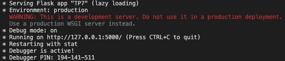

Il est ensuite possible d'ouvrir un navigateur à l'adresse spécifiée dans la sortie console. Ici c'est 127.0.0.1:5000. Le navigateur montre alors une page de connexion :

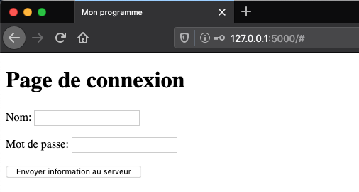

Une fois que l'utilisateur a entré son nom et son mot de passe qui doivent être contenus dans un fichier "users" dans le même dossier que TP7.py, l'utilisateur est emmené vers la page suivante : 

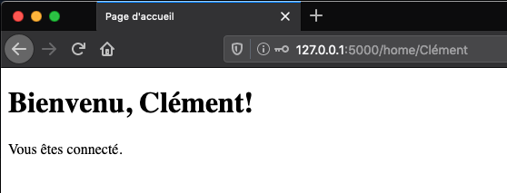

Le code de l'application est le suivant : 

```python
from flask import Flask, redirect, url_for, render_template, request

app = Flask(__name__)

def login(nom, mdp):
    """ Fonction de connexion

    Args:
        nom (str) le nom de l'utilisateur à authentifier
        mdp (str) le mot de passe de l'utilisateur
    Returns:
        True si le couple est bien présent dans le fichier "users", 
        False sinon
    """
    is_auth = False
    try:
        with open("users", "r") as usersfile:
            file_content = usersfile.readlines()
            for num_line in range(len(file_content)):
                if file_content[num_line] == nom + ";" + mdp:
                    is_auth = True
            usersfile.close()
    except: 
        print("!!! Impossible d'ouvrir le fichier des utilisateurs")
    finally:
        return is_auth

# Définition de la page d'accueil de l'application
# où l'utilisateur doit s'identifier. Elle n'a pas d'adresse particulière
@app.route("/", methods=["POST", "GET"])
def index():
    if request.method == "POST":
        ## Gestion de la requête POST envoyée lors de l'appui sur le bt
        # Récupération du nom et mot de passe saisis
        user = request.form["name"]
        pswd = request.form["password"]
        # Identification à partir du fichier "users"
        if login(user, pswd) == True:
            # Redirection vers le page "home" avec le nom du user
            return redirect(url_for("home", username=user))
        else: 
            return render_template("index.html")
    else:
        return render_template("index.html")

# Définition de la page "home" d'adresse "home/nom_du_user"
@app.route("/home/<username>")
def home(username):
    return render_template("home.html", content=username)

if __name__ == "__main__":
    app.run(debug=True)
```

De plus, la page HTML d'accueil est la suivante:

```html
<!DOCTYPE html>
    <head>
        <title>Mon programme</title>
    </head>
    <body>
        <h1>Page de connexion</h1>
        <form action="#" method="post">
            <p>
                Nom:
                <input type="text" name="name" />
            </p>
            <p>
                Mot de passe:
                <input type="password" name="password" />
            </p>
            
            <input type="submit" 
                    name="send" 
                    value="Envoyer information au serveur" />
        </form>
    </body>
</html>
```

Enfin, la page de l'utilisateur est :

```html
<!DOCTYPE html>
    <head>
        <title>Page d'accueil</title>
    </head>
    <body>
        <h1>Bienvenue, {{content}}!</h1>
        <p>Vous êtes connecté.</p>
    </body>
</html>
```

On peut remarquer l'utilisation des double-accolades qui permettent de lier le code décrit dans TP7.py avec la variable content. Lorsque cette page sera renvoyée par le serveur, la variable `content`sera remplacée par le contenu désirée, en l'occurrence, ici, le nom de l'utilisateur.
